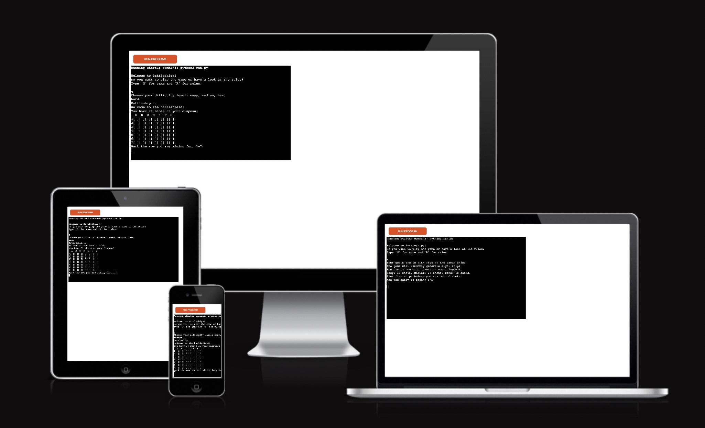
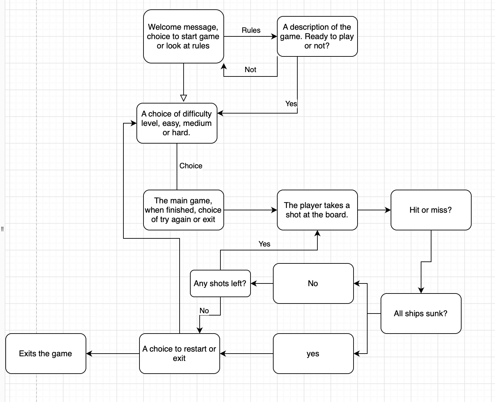
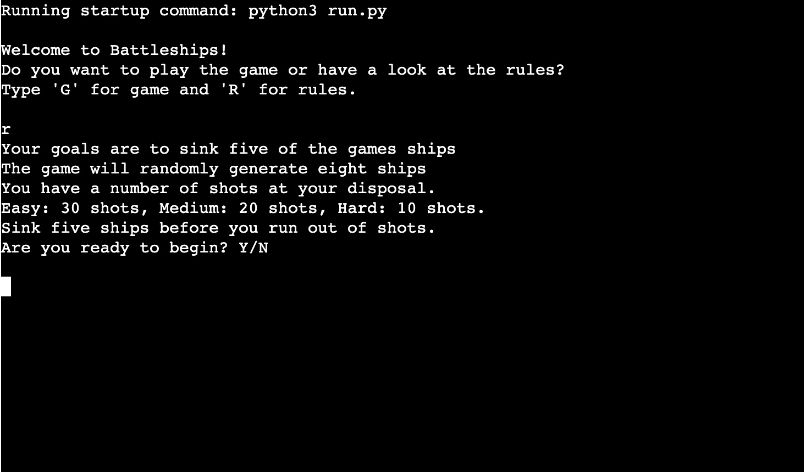
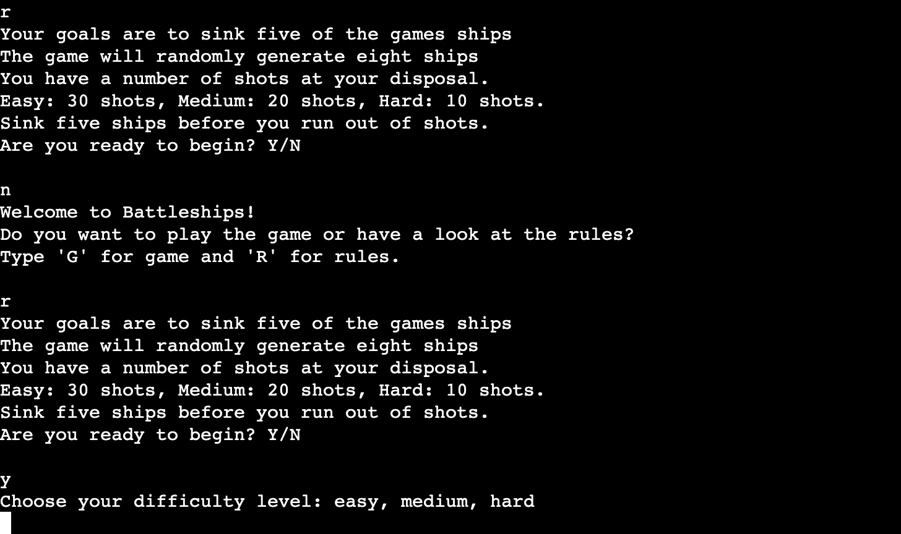
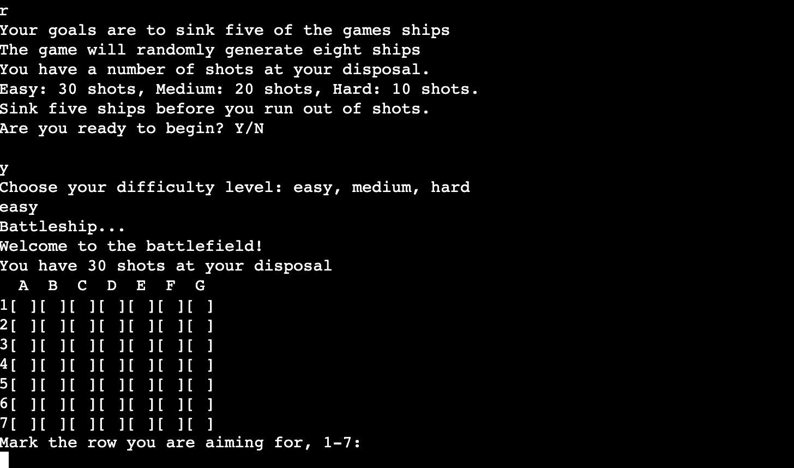
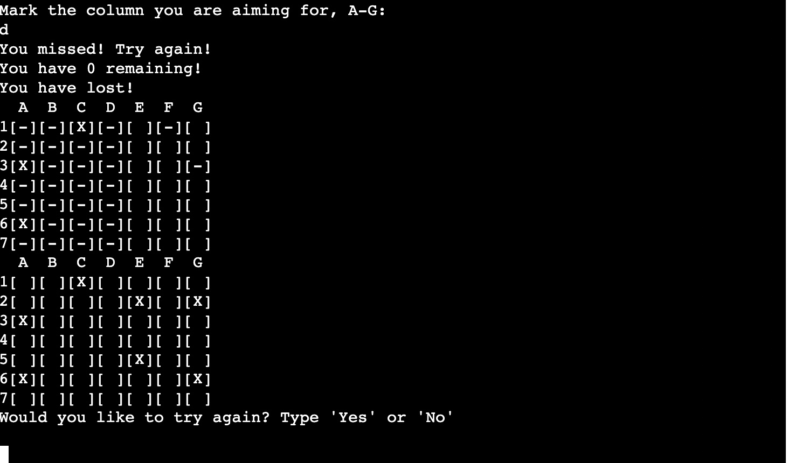
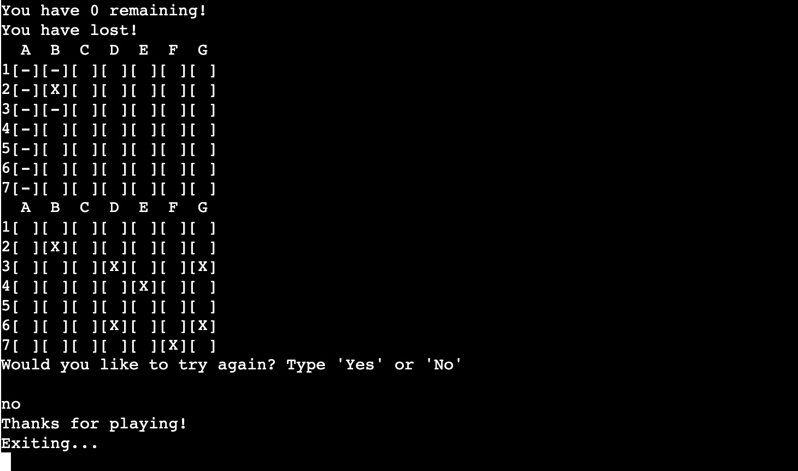
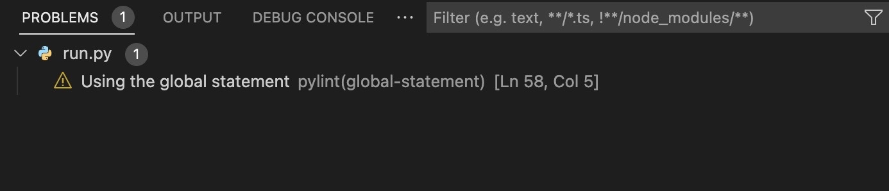

# Battleships

## Introduction

Hello, this will be my third project for Code Institute and this time it will be pure Python code with a mock terminal provided by Code Institute.

Try it out [here](https://battleshipcodeinstitute.herokuapp.com/)

## Table content

1. [User Experience](#user-experience)
    1. [Project Goals](#project-goals)
    2. [User Experience](#user-experience)
    3. [Flow Chart](#flow-chart)
2. [Project Design](#project-design)
    1. [The Game](#the-game)
3. [Technologies Used](#technologies-used)
    1. [Languages Used](#language-used)
    2. [Programs Used](#program-used)
4. [Testing](#testing)
    1. [Player Testing](#player-testing)
    2. [Code Validation](#code-validation)
    3. [Manual Testing](#manual-testing)
    4. [Bugs](#bugs)
5. [Deployment](#deployment)
    1. [Heruko](#heruko)
6. [Credits](#credits)

***

## User Experience

### Project Goals

* This project is a simple game version of the classic game Battleships, in this version you will get several turns or as the game calls it, shots, to find small ships on a 7 by 7 board.

* You will get a choice of difficulty levels to choose from, easy, medium or hard. The number of shots will be decided here.

### User Experience

* The player experience should be straightforward with easy choices and well-structured choices so as not to confuse the player.

### Flow Chart

[Back to top ⇧](#Battleships)

## Project Design

### The Game

    - This will be the first choice for the player, to just start the game or have a look at the rules for the game.

    - If the player chooses rules, this will aper for the player and a choice to start the game or just go back to the previous menu.

    - The outcome will be the same if the player starts the game from the main menu or from "the rules" choice.

    - From this point on the player will choose rows and columns for each shot.

    - At the end of the game, win or lose, the player will have a look at where the ships were hidden and a choice to try again, if the player chooses "try again" they will go back to the difficulty and go from there.

    - If the player chooses no the exit_game command will be run and exits the app.

[Back to top ⇧](#Battleships)

## Technologies Used

### Languages Used

* [Python](https://en.wikipedia.org/wiki/Python_(programming_language))

### Programs Used

* [VS Studio Code](https://code.visualstudio.com)

    - Vs Studio Code was used to write the code and to commit and push content to GitHub.

* [Am I Responsive?](http://ami.responsivedesign.is/#)

    - "Am I Responsive" was used to see responsive design throughout the process and to generate a mockup image.

* [Diagrams.net](https://www.diagrams.net) 

    - Diagrams.net was used to create a chart of the player experience.

[Back to top ⇧](#Battleships)

## Testing

### Player Testing

* The flow of the game and the player choices have to be logical and simple to understand.

### Code Validation

* As of this day,2022-09-30, http://pep8online.com is offline so I turned to the inbuilt validation in vs-code to find and eliminate warnings and errors.

    - I have chosen to ignore this warning since it is only one global statement, don't see anything wrong with using it in this case.

### Manual Testing

* Input anything else in the input field at the menus to see if the game crashed.
* The expectations were that the game would return an invalid option and ask the player to input a correct option.
* The outcome was as expected.

### Bugs

* Input out of range at the shot placement. Solved it by putting -1 in the return value on line 127.
* No remaining bugs, only the one warning about the global variable.

[Back to top ⇧](#Battleships)

## Deployment

### Heruko

I used Heruko to deploy my application.
1. Push the project to GitHub using vs-code.
2. On Heruko I logged in with my account.
3. Select new in the top right corner. From the menu, I chose "Create new app".
4. Choose a unique name for the app and the correct region that you are in. For me it is Europe.
5. Connect to my GitHub account.
6. Search for my repo name for the project on GitHub.
7. Select the project that was relevant for the project.
8. Go to the settings tab.
9. Select the buildpack.
10. Select Python, and save changes.
11. Select NodeJs, and save changes.
12. Make sure that Python is first and not NodeJs.
13. Add a config var. The key will be "Port" and the value is "8000".
13. Navigate to the deploy tab.
14. Scroll down and select the "Manual Deploy" and select "Deploy Branch".

[Back to top ⇧](#Battleships)

## Credits

* The project "love sandwiches" for knowledge to apply to the project.
* Slack community for help when I got stuck.
* https://www.youtube.com/c/ArjanCodes for inspiration for my code.
* https://www.youtube.com/watch?v=MgJBgnsDcF0 for inspiration for my code.
* To Marcel my mentor for pushing me to always do more.

[Back to top ⇧](#Battleships)