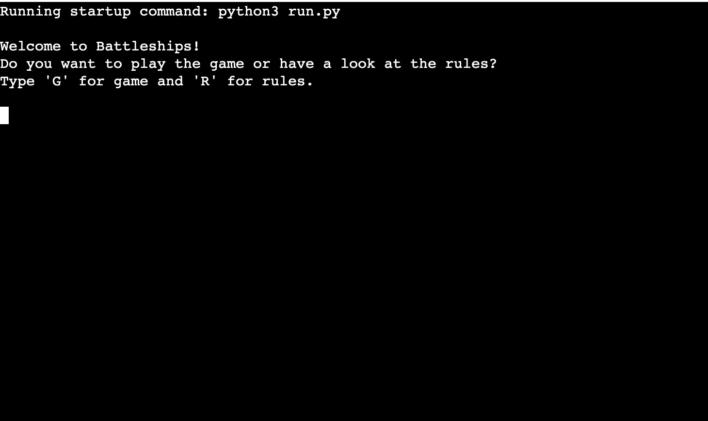
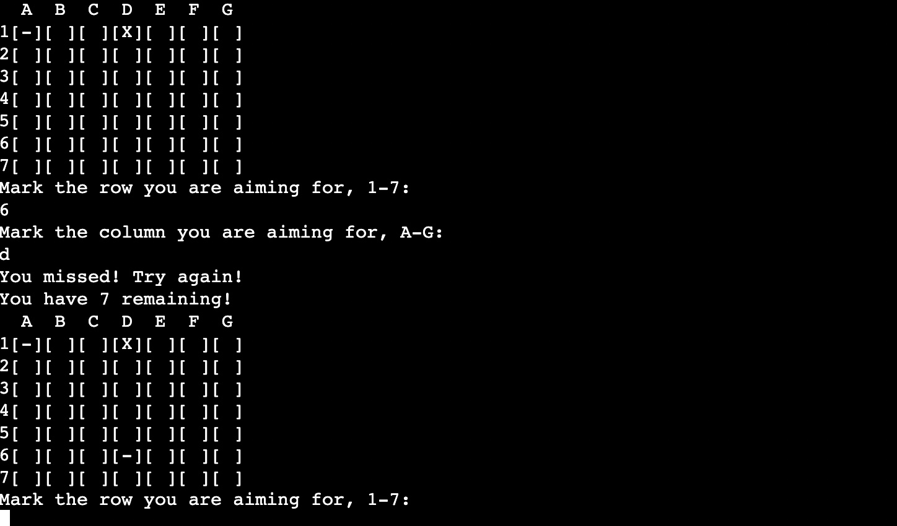

# Battleships

## Introduction

Hello, this will be my third project for Code Institute and this time it will be pure Python code with a mock terminal provided by Code Institute.

Try it out [here](https://battleshipcodeinstitute.herokuapp.com/)

## Table content

1. [User Experience](#user-experience)
    1. [Project Goals](#project-goals)
    2. [User Experience](#user-experience)
    3. [Flow Chart](#flow-chart)
2. [Project Design](#project-design)
    1. [The Game](#the-game)
3. [Technologies Used](#technologies-used)
    1. [Languages Used](#language-used)
    2. [Programs Used](#program-used)
4. [Testing](#testing)
    1. [Player Testing](#player-testing)
    2. [Code Validation](#code-validation)
    3. [Manual Testing](#manual-testing)
    4. [Bugs](#bugs)
5. [Deployment](#deployment)
    1. [Heruko](#heruko)
6. [Credits](#credits)

***

## User Experience

### Project Goals

* This project is a simple game version of the classic game Battleships, in this version you will get several turns or as the game calls it, shots, to find small ships on a 7 by 7 board.

* You will get a choice of difficulty levels to choose from, easy, medium or hard. The number of shots will be decided here.

* You will win the game if you find five of the eight ships on the board. If you can't find five ships when you run out of shots, you will lose the game.

### User Experience

* The player experience should be straightforward with easy choices and well-structured choices so as not to confuse the player.

### Flow Chart

[Back to top ⇧](#Battleships)

## Project Design

### The Game

* This will be the first choice for the player, to just start the game or have a look at the rules for the game.

* If the player chooses rules, this will aper for the player and a choice to start the game or just go back to the previous menu.

*The outcome will be the same if the player starts the game from the main menu or the choices from the rules.

* From this point on the player will choose rows and columns for each shot.

* At the end of the game, win or lose, the player will have a look at where the ships were hidden and a choice to try again, if the player chooses "try again" they will go back to the difficulty and go from there.

* If the player chooses no the exit_game command will be run and exits the app.

[Back to top ⇧](#Battleships)

## Technologies Used

### Languages Used

* [Python](https://en.wikipedia.org/wiki/Python_(programming_language))
    * Imported libraries random
    * Imported libraries time
    * Imported libraries sys

### Programs Used

* [VS Studio Code](https://code.visualstudio.com)

    - Vs Studio Code was used to write the code and to commit and push content to GitHub.

* [Am I Responsive?](http://ami.responsivedesign.is/#)

    - "Am I Responsive" was used to see responsive design throughout the process and to generate a mockup image.

* [Diagrams.net](https://www.diagrams.net) 

    - Diagrams.net was used to create a chart of the player experience.

[Back to top ⇧](#Battleships)

## Testing

### Player Testing

The player starts with a choice of playing the game (G) or having a look at the rules (R).

If the player goes for the rules (R) option, the game will explain the conditions of the game.

From here the player can either go back to the first menu by choosing N for no or choose Y for yes.

If the player goes for Y then the outcome will be as if the player chooses game (G) in the first menu. The next choice will be to determine the difficulty level.

When the player has chosen a difficulty level, the game will start and print a board and display the number of shots left. Depending on the difficulty level either 30, 20 or 10 shots will be displayed.
And a choice of putting the coordinates for the first shot in form of a choice from 1-7 and A-G.

The board will reprint an updated version of the choices the player made, a - for a miss and an X if the player sunk a ship and the number of shots remaining.

When the player has used up all shots or sunk five ships the game will display the hidden ships and give a choice of try again Yes or No. If the player chooses yes, the menu of difficulty levels will be called, if the player goes for no then the game will exit.

### Code Validation

* As of this day,2022-09-30, http://pep8online.com is offline so I turned to the inbuilt validation in vs-code to find and eliminate warnings and errors.

I have chosen to ignore this warning since it is only one global statement, don't see anything wrong with using it in this case.

### Manual Testing

* Input anything else in the input field at the menus to see if the game crashed.

* The expectations were that the game would return an invalid option and ask the player to input a correct option.
* The outcome was as expected.

### Bugs

* Input out of range at the shot placement. Solved it by putting -1 in the return value on line 127.
* No remaining bugs, only the one warning about the global variable.

[Back to top ⇧](#Battleships)

## Deployment

### Heruko

I used Heruko to deploy my application.
1. Push the project to GitHub using vs-code, make sure you have pushed the final version.
2. On Heruko sign up for a free account or sign in with an existing one.
3. Select new in the top right corner. From the menu chose "Create new app".
4. Choose a unique name for the app and the correct region that you are in. For me it is Europe.
5. Click the "Create app".
6. In the deployment section select "Connect to GitHub"
7. Select the project that was relevant to the project you want to deploy, and click "Connect".
8. Go to the settings tab.
9. Scroll to the section named "Buildpacks", from here click "Add Buildpacks".
10. Select Python, and save changes.
11. Select NodeJs, and save changes.
12. Make sure that Python is first and not NodeJs, you can change the order of them by dragging and dropping them.
13. Add a config var. The key will be "PORT" and the value is "8000", make sure you spell PORT in all capital letters.
13. Navigate to the deploy tab.
14. Scroll down and select the "Manual Deploy" and select "Deploy Branch".
15. Heruko will notify you when the app is successfully deployed.
16. If you want to rebuild your app automatically you can also select the 'Enable Automatic Deploys' button which will then rebuild the app every time you push any changes.

[Back to top ⇧](#Battleships)

## Credits

* The project "love sandwiches" for knowledge to apply to the project.
* Slack community for help when I got stuck.
* https://www.youtube.com/c/ArjanCodes for inspiration for my code.
    * The use of globals and structure.
* https://www.youtube.com/watch?v=MgJBgnsDcF0 for inspiration for my code.
    * Manly structure and how to use the code well.
* To Marcel my mentor for pushing me to always do more.

[Back to top ⇧](#Battleships)